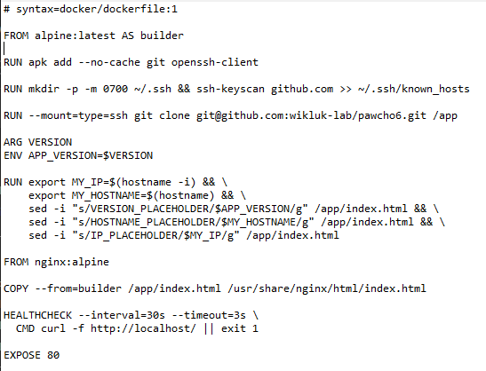
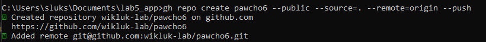
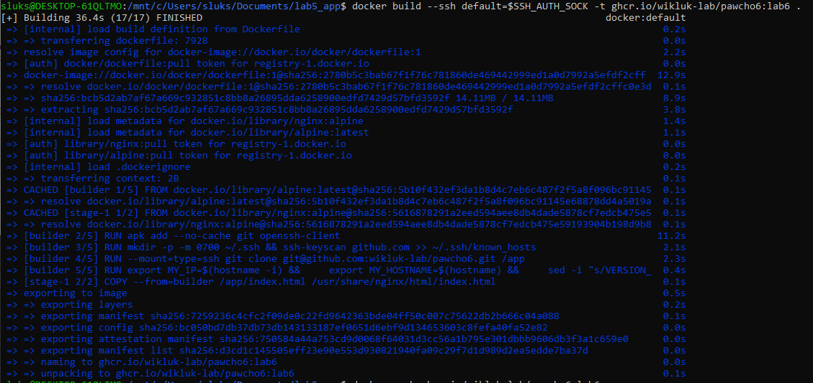
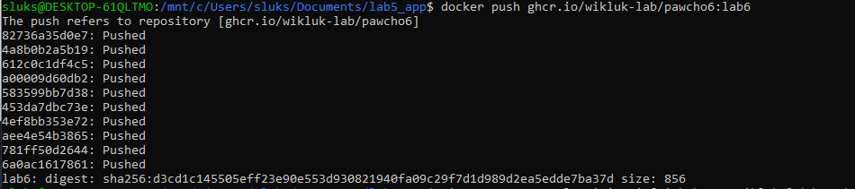

Dockerfile: 

Repo: gh repo create pawcho6 --public --source=. --remote=origin --push

Build: docker build --ssh default=$SSH_AUTH_SOCK -t ghcr.io/wikluk-lab/pawcho6:lab6 .

Push: docker push ghcr.io/wikluk-lab/pawcho6:lab6

